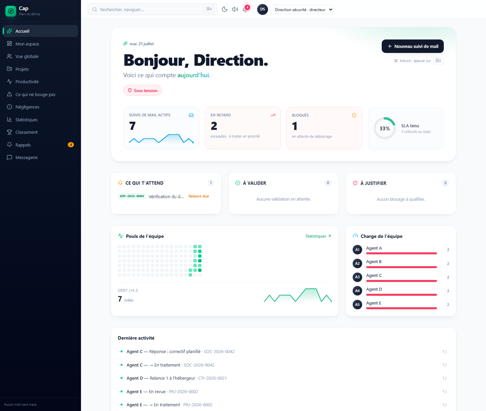
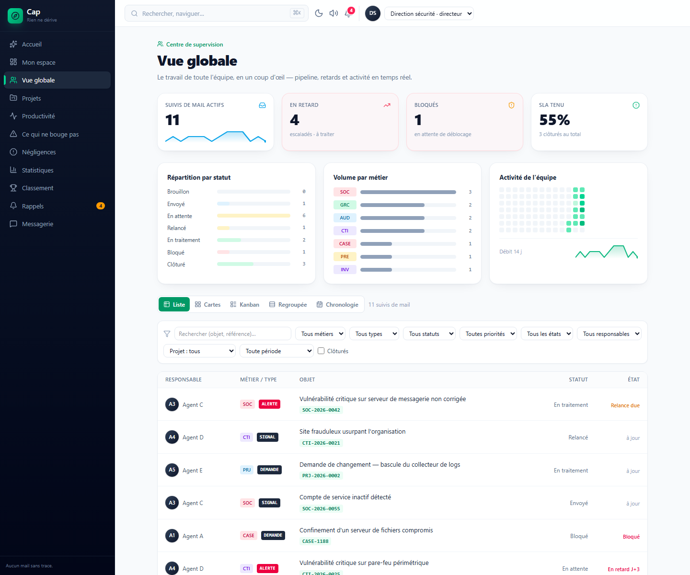
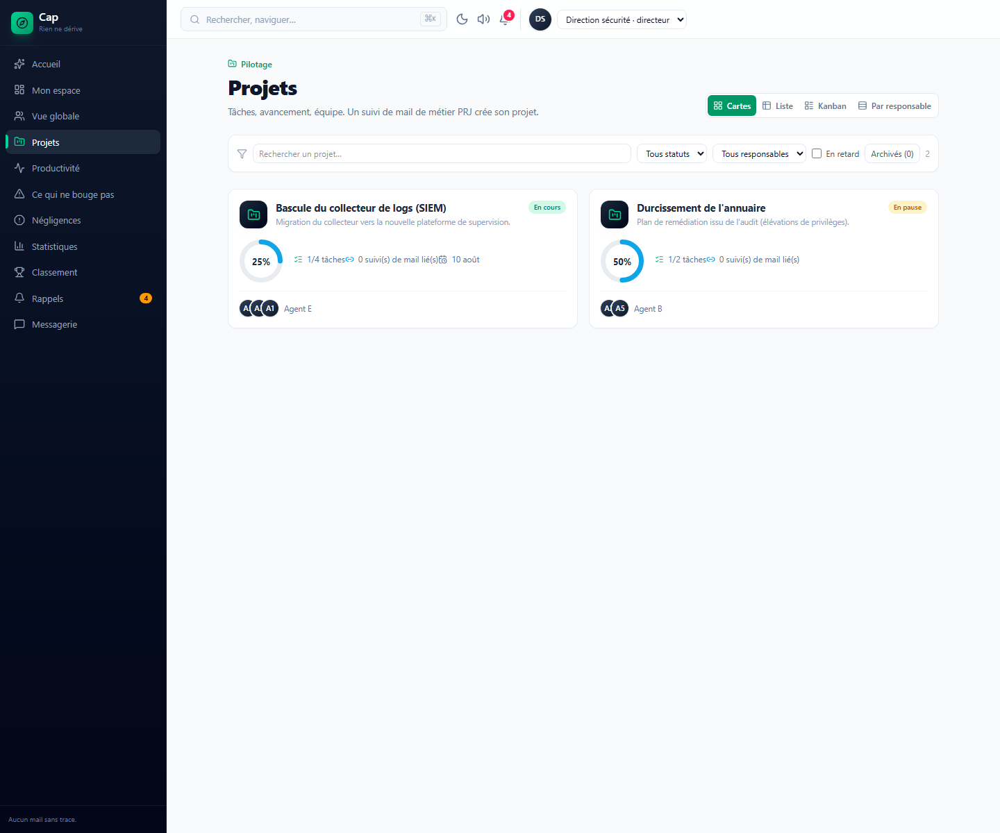
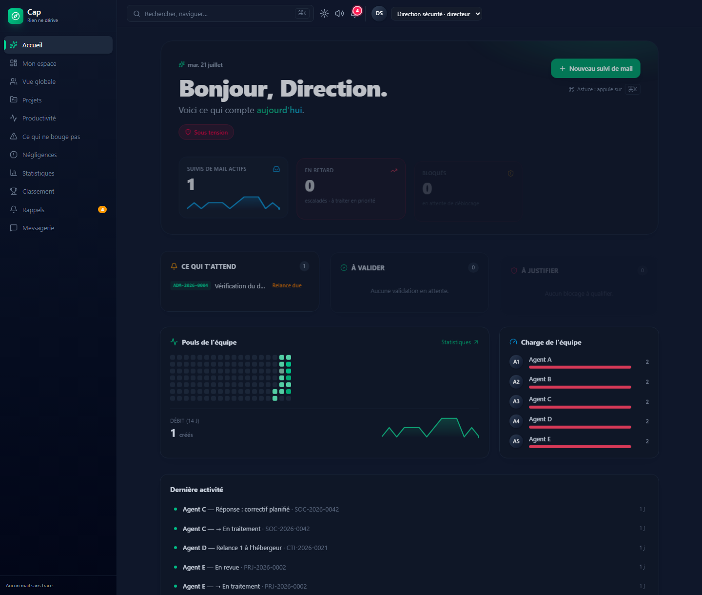

<div align="center">

# Cap

**Rien ne dérive. — Aucun mail sans trace.**

Plateforme interne de **suivi de mail** et de pilotage d'équipe pour un service sécurité (DSSI) :
aucun mail de service ne reste sans réponse, relances et escalades automatiques, blocages visibles,
projets, productivité, messagerie et négligences — le tout **100 % local (LAN), sans cloud**.

[](../../actions/workflows/ci.yml)
[](LICENSE)


</div>

> **🇫🇷 Français** ci-dessous · **🇬🇧 [English summary](#-english-summary)** at the bottom.

## 📸 Aperçu · Screenshots

<table>
  <tr>
    <td width="50%"><br/><sub><b>Cockpit</b> — accueil, briefing du jour & data-viz</sub></td>
    <td width="50%"><br/><sub><b>Vue globale</b> — centre de supervision de l'équipe</sub></td>
  </tr>
  <tr>
    <td width="50%"><br/><sub><b>Projets</b> — avancement, jauges & équipe</sub></td>
    <td width="50%"><br/><sub><b>Mode sombre</b> — thème clair / sombre sur toute l'app</sub></td>
  </tr>
</table>

<sub>Captures réalisées en mode démonstration (<code>NEXT_PUBLIC_DEMO=1</code>), avec des données fictives. Palette de commandes <kbd>⌘K</kbd>, notifications sonores et confettis à la clôture non visibles ici 🙂</sub>

---

## ✨ Fonctionnalités

### Suivi & relances
- **📥 Suivi de mail** — chaque mail de service est tracé (référence normalisée anti-collision, objet, priorité, personnes, points clés), avec statut et **timeline** complète ; **pièces jointes / preuves** attachables.
- **🔔 Relances & escalades automatiques** — SLA par type ; l'application rappelle, escalade vers la direction et envoie un digest quotidien (in-app, **e-mail réel optionnel** via Resend). **Modèles de relance** réutilisables et **envoi direct** de la relance au destinataire (compté dans le suivi, réponse dirigée vers l'agent).
- **⏱️ Durée de traitement** — échéance « acceptable » par suivi, mise en évidence des dépassements et marquage « en retard ».
- **📨 Import d'e-mail (.eml)** — déposer la réponse reçue : Cap la rattache automatiquement au bon suivi (via la référence de l'objet) et l'enregistre comme réponse, l'e-mail original attaché en preuve.
- **🧱 Blocages** — vue dédiée « ce qui ne bouge pas » ; l'agent qualifie le motif et consigne les démarches de déblocage.

### Pilotage d'équipe
- **📁 Projets** — tâches, avancement, membres, notes ; workflow de statut (manager propose → directeur valide) et **demande de clôture** (récapitulatif + livrables) validée par un manager/directeur.
- **🎯 Plan de l'année** — objectifs annuels, jalons, avancement dérivé des projets et tâches liés.
- **✅ Productivité** — vue d'équipe : charge, rendement, tâches assignables avec sous-tâches, planification et statuts.
- **🏆 Classement & gamification** — XP, niveaux, badges, défis de la semaine, membre du mois.
- **💬 Messagerie interne** — messages privés (1:1), groupes, fils sur un suivi / une négligence / un projet, réactions emoji, réponses ciblées, notifications avec **bip sonore**.

### Conformité & rapports
- **⚠️ Négligences** & **🚫 Non-conformités à la politique de sécurité** — deux registres transmis au DG (décision sur document imprimé), service/personne en cause, cadran de décisions et **rapports imprimables**.
- **📊 Statistiques & rapports** — tableau de bord **réorganisable (glisser-déposer)** ; répartitions par émetteur / destinataire / service / criticité / appréciation / cause ; **export PDF** sur période libre et **export CSV**.

### Sécurité & administration
- **🔐 Authentification** — inscription soumise à approbation, **double authentification (TOTP)** + codes de secours, **sessions actives** révocables, **alerte de connexion depuis un appareil inconnu**.
- **🧾 Journal d'audit** — événements sensibles tracés et filtrables (connexions, 2FA, gestion des comptes, sauvegardes…).
- **👤 Espace membre** — profil, avatar, changement de mot de passe, suppression de compte.
- **💾 Sauvegarde & restauration** — export/restauration de la base, et **sauvegardes automatiques planifiées** avec rétention.
- **🛡️ RBAC & paramètres** — rôles (agent / manager / directeur / admin / DSI), accès par vue configurables, comptes en lecture seule, politique de sécurité pilotable depuis l'interface.

## 🧱 Stack technique

| Domaine | Choix |
|---|---|
| Framework | **Next.js 16** (App Router, TypeScript, Turbopack) |
| UI | **React 19**, **Tailwind CSS 4**, icônes **lucide-react**, glisser-déposer **@dnd-kit** |
| Données | **SQLite** local via **better-sqlite3** (fichier unique, WAL) — aucun serveur externe |
| Auth | Sessions par cookie httpOnly, hachage **scrypt** & **TOTP** (`node:crypto`, sans dépendance) |
| Graphes | **recharts** |
| Tests | **Vitest** (logique métier pure) |

Aucun cloud, aucun Docker : l'application se déploie sur un serveur de l'entreprise et s'utilise dans le **LAN**.

## 🚀 Démarrage rapide

**Prérequis :** Node.js ≥ 20 (testé sur 24) et npm.

```bash
# 1. Installer les dépendances
npm install

# 2. (Optionnel) copier le modèle d'environnement
cp .env.local.example .env.local

# 3. Lancer en développement
npm run dev
# → http://localhost:3000
```

Au **premier lancement**, la base `data/cap.sqlite` est créée automatiquement.

> **🔑 Premier compte = administrateur.** Le tout premier compte créé via l'écran d'inscription
> devient **administrateur** et est **approuvé d'office**. Toutes les inscriptions suivantes sont
> **en attente d'approbation** par un administrateur (paramétrable dans **Administration → Sécurité**).

### Déploiement LAN (production)

```bash
npm run build
npm run start:lan   # écoute sur 0.0.0.0:3000 — accessible depuis le réseau local
```

En HTTPS, lancer avec `COOKIE_SECURE=1` (et activer HSTS depuis l'administration).

📖 Guide détaillé d'hébergement sur le réseau local : [`docs/HEBERGEMENT_LAN.md`](docs/HEBERGEMENT_LAN.md).

## ⚙️ Configuration

Toutes les variables sont **optionnelles** et documentées dans [`.env.local.example`](.env.local.example) :
`DATABASE_PATH`, `NEXT_PUBLIC_ORG_NAME`, `COOKIE_SECURE`, `CRON_SECRET`, `RESEND_API_KEY`, `RESEND_FROM`, `NEXT_PUBLIC_DEMO`.

## 🔐 Sécurité

- **Approbation des inscriptions** par un administrateur ; les comptes non approuvés n'accèdent à aucune donnée (blocage côté layout **et** côté API).
- **Double authentification (TOTP)** compatible avec les applications d'authentification, **codes de secours** à usage unique, 2FA activable/imposable ; sans aucune dépendance externe.
- **Sessions actives** listées et **révocables** (par appareil), et **alerte** en cas de connexion depuis un appareil inconnu (notification in-app + e-mail).
- **Journal d'audit** des événements sensibles (connexions, 2FA, comptes, sauvegardes…), filtrable et exportable.
- **RBAC** par rôle et **accès par vue** configurables ; comptes en **lecture seule** (le rôle DSI l'est toujours) appliqués côté serveur sur toutes les routes mutantes.
- **Rate-limiting** de la connexion et de l'inscription (seuils configurables).
- **En-têtes de sécurité** posés sur chaque réponse (CSP stricte, X-Frame-Options, nosniff, Referrer-Policy, Permissions-Policy) + **HSTS** activable à chaud.
- **Sessions** : jeton fort, expiration glissante, rotation à la connexion.
- **Rotation des mots de passe** : politique d'âge et « forcer le renouvellement » par utilisateur.

Tout est paramétrable depuis **Administration → Sécurité**. Pour signaler une vulnérabilité, voir [`SECURITY.md`](SECURITY.md).

## 💾 Sauvegarde & restauration

Depuis **Administration → Sauvegarde** (réservé aux administrateurs) :

- **Télécharger** un instantané complet de la base (fichier `.sqlite` unique, cohérent — contenu WAL inclus) et le **restaurer** depuis un fichier (validation + instantané de sécurité `.bak` automatique avant remplacement).
- **Sauvegardes automatiques planifiées** (quotidiennes/hebdomadaires) écrites dans `data/backups/`, avec **rétention** configurable — déclenchées à l'usage de l'application, sans tâche planifiée externe.

> ⚠️ Les sauvegardes vivent sur le **même serveur** que la base : copiez régulièrement `data/backups/` vers un stockage distinct (partage réseau, disque externe) pour vous prémunir d'une panne disque.

## 🗂️ Structure du projet

```
app/          Routes (App Router) : (app)/ pages protégées, api/ routes serveur, login, pending, change-password
components/    Composants React (Shell, Drawer, modales, Discussion, atomes…)
lib/
  domain.ts   Types & logique métier (source de vérité)
  db/         Accès SQLite (schéma, migrations additives, dépôts, sauvegarde)
  auth/       Sessions, hachage, TOTP, gardes, rate-limit, alerte de connexion
  email/      Parseur d'e-mail .eml (RFC 822/MIME)
  reminders/  Moteur de relance/escalade/digest (+ envoi Resend)
  backup/     Planificateur de sauvegarde in-app
  nav.ts      Navigation & contrôle d'accès par vue
proxy.ts      En-têtes de sécurité (runtime Node)
tests/        Tests unitaires Vitest (logique métier pure)
data/         Base SQLite locale + sauvegardes (git-ignorées)
```

## 📜 Scripts

| Script | Rôle |
|---|---|
| `npm run dev` | Serveur de développement |
| `npm run build` | Build de production |
| `npm run start` / `start:lan` | Serveur de production (LAN) |
| `npm run reminders` | Déclenche le moteur de relance (à planifier via le planificateur du serveur) |
| `npm run lint` | Analyse ESLint |
| `npm test` / `test:watch` | Tests unitaires **Vitest** (exécution unique / mode veille) |

## 🧪 Tests

Tests unitaires de la **logique métier pure** (sans base ni navigateur), rapides et déterministes :

```bash
npm test            # exécution unique
npm run test:watch  # mode veille
```

Couvrent notamment l'horloge SLA et l'état de relance, les échéances de traitement, la référence anti-collision, le parse d'objet et le **parseur d'e-mail `.eml`** (RFC 822/MIME), la **double authentification** (TOTP + codes de secours), les agrégats (classement, projets, productivité, gamification), la validation de sauvegarde et les libellés d'audit. Exécutés aussi en **CI** (lint + tests + build) à chaque push/PR.

## 🤝 Contribuer

Les contributions sont bienvenues — voir [`CONTRIBUTING.md`](CONTRIBUTING.md) et le [code de conduite](CODE_OF_CONDUCT.md).
Le suivi des changements est dans [`CHANGELOG.md`](CHANGELOG.md).

## 📄 Licence

Distribué sous licence **MIT** — voir [`LICENSE`](LICENSE).

---

## 🇬🇧 English summary

**Cap** is a self-hosted, LAN-only platform for **email follow-up** and team operations for a security team.
It ensures no service email goes untracked: automated reminders and escalations, real reminder e-mails and
**`.eml` reply import**, blockers surfacing, projects, yearly objectives, team productivity, gamification,
internal messaging, negligence & policy non-compliance registers — all backed by a single local **SQLite** file,
**no cloud, no Docker**.

Built with **Next.js 16 / React 19 / TypeScript / Tailwind CSS 4**, **better-sqlite3** and **Vitest**.

**Quickstart:** `npm install` → `npm run dev` → open `http://localhost:3000`.
The **first registered account becomes the administrator** (auto-approved); every later sign-up requires admin
approval (configurable). Security — approval, **two-factor auth (TOTP)**, active-session revocation, unknown-device
login alerts, an audit log, RBAC, per-view access, read-only accounts, rate-limiting, security headers, HSTS,
password rotation — is fully configurable from **Administration → Security**. Database **backup/restore** and
scheduled automatic backups are built in.

Licensed under **MIT**. See [`CONTRIBUTING.md`](CONTRIBUTING.md) and [`SECURITY.md`](SECURITY.md).
